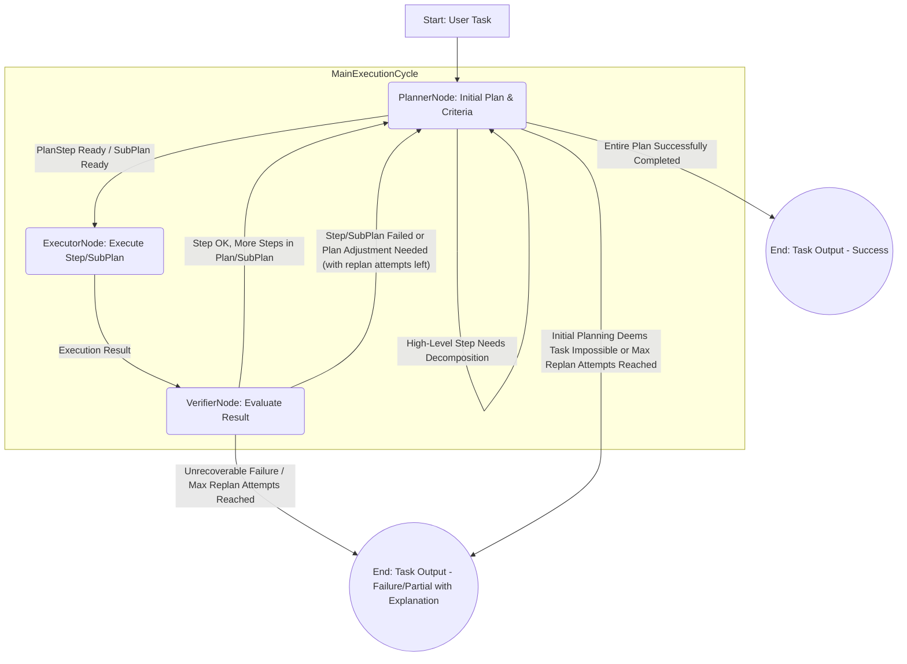

```mermaid
graph TD
    A[Start: User Task] --> B(PlannerNode: Initial Plan & Criteria);
    subgraph MainExecutionCycle
        direction LR
        B -- PlanStep Ready / SubPlan Ready --> C(ExecutorNode: Execute Step/SubPlan);
        C -- Execution Result --> D(VerifierNode: Evaluate Result);
    end

    B -- High-Level Step Needs Decomposition --> B;
    D -- Step OK, More Steps in Plan/SubPlan --> B;
    D -- Step/SubPlan Failed or Plan Adjustment Needed (with replan attempts left) --> B;

    B -- Entire Plan Successfully Completed --> F((End: Task Output - Success));
    D -- Unrecoverable Failure / Max Replan Attempts Reached --> G((End: Task Output - Failure/Partial with Explanation));
    B -- Initial Planning Deems Task Impossible or Max Replan Attempts Reached --> G;
```